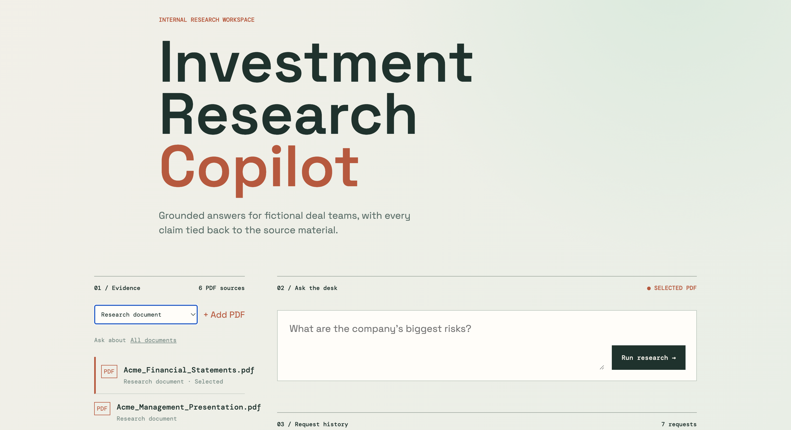
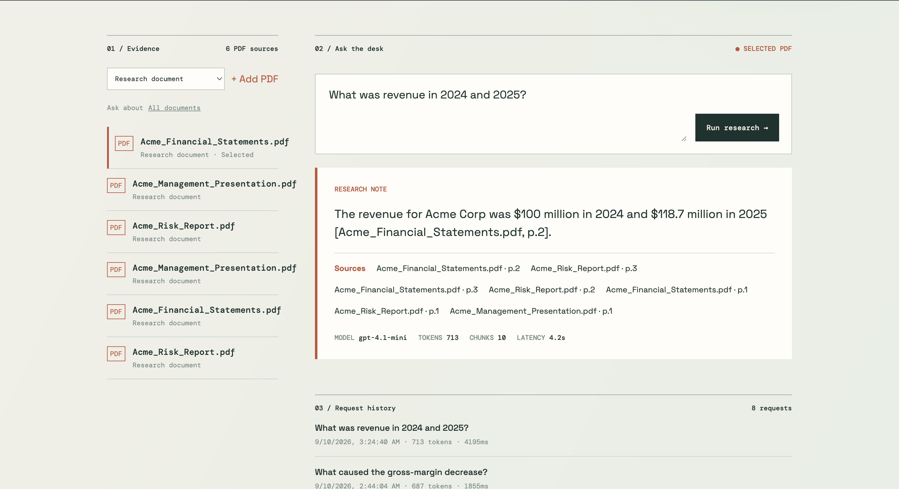
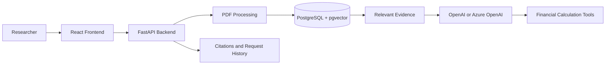

# Investment Research Copilot

Investment Research Copilot is a small AI research assistant for investment and private equity teams.

Users upload company documents, ask questions, and receive answers grounded in the uploaded material. Responses include document and page citations, financial calculations, request metadata, and a history of previous research questions.

The project uses fictional Acme Corp documents for demonstration.

## Screenshots

### Research Workspace



### Document-Scoped Research



## What It Does

- Uploads and processes PDF documents
- Preserves document and page information for citations
- Searches uploaded documents using semantic retrieval
- Answers questions using OpenAI or Azure OpenAI
- Performs financial calculations with deterministic Python tools
- Displays sources, token usage, retrieved chunks, latency, and tool calls
- Keeps a lightweight history of previous AI requests
- Allows questions to be scoped to one uploaded document or all documents

## Example Questions

- What are Acme's biggest risks?
- What was revenue growth between 2024 and 2025?
- What is the company's debt-to-EBITDA ratio?
- Should we investigate this company further?

## How It Works



## Hosted Deployment

- Frontend: Vercel
- Backend: Railway
- Database: Neon PostgreSQL with pgvector

## Run Locally

1. Create a `.env` file with your OpenAI key:

```env
LLM_PROVIDER=openai
OPENAI_API_KEY=your-api-key
```

2. Start the application:

```bash
docker compose up --build
```

3. Open the hosted frontend at [https://investment-research-copilot.vercel.app](https://investment-research-copilot.vercel.app).

4. Generate the fictional demo PDFs:

```bash
docker compose exec backend python scripts/create_demo_pdfs.py --output-dir /app/demo
```

5. Upload the files from `demo/` and start asking questions.

## Technology

- Python and FastAPI
- React and TypeScript
- PostgreSQL and pgvector
- PyMuPDF for PDF processing
- OpenAI or Azure OpenAI
- Docker Compose

## Limitations

This is a portfolio MVP using fictional data. It is not investment advice and is not a production financial-services, compliance, or regulatory system. It does not include authentication, real-time market data, or confidential company information.
