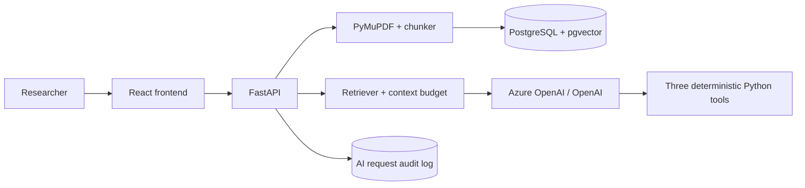

# Investment Research Copilot

A small, source-grounded investment research assistant for fictional deal-team documents. It demonstrates document ingestion, page-aware RAG, pgvector retrieval, deterministic financial tools, token metadata, and lightweight audit logging.

> Demo data only. This is not investment advice and is not a production financial-services or regulatory-compliance system.

## Run locally

1. Copy `.env.example` to `.env` and set Azure OpenAI credentials (or set `LLM_PROVIDER=openai` and `OPENAI_API_KEY`).
2. Run `docker compose up --build`.
3. Open `http://localhost:5173`.
4. Upload fictional Acme Corp PDFs and ask questions such as:
   - What are Acme's biggest risks?
   - What was revenue growth between 2024 and 2025?
   - What is the company's debt-to-EBITDA ratio?

The API is available at `http://localhost:8000/docs`. The database contains no real company data.

## Architecture



## Design decisions

- **PostgreSQL + pgvector:** one understandable persistence layer for documents, embeddings, and request history.
- **RAG:** answers are constrained to retrieved page-aware chunks and return structured citations.
- **Deterministic tools:** revenue growth, debt/EBITDA, and profit margin run in Python, not in model arithmetic.
- **Context budget:** retrieval considers ten candidates, then keeps the best chunks under `MAX_CONTEXT_TOKENS` (implemented as a conservative word budget).
- **Provider boundary:** Azure OpenAI is documented as primary; OpenAI can be selected without changing RAG code.

## Project layout

- `backend/app/documents`: PDF extraction and chunking
- `backend/app/rag`: retrieval and prompts
- `backend/app/agent`: financial tools
- `backend/app/llm`: provider abstraction and adapters
- `backend/app/api`: upload, chat, and request-history routes
- `frontend/src`: minimal evidence and chat workspace

## Development checks

```bash
PYTHONPATH=backend python3 -m pytest backend/tests -q
python3 -m compileall -q backend
```

The test suite covers the deterministic calculations and page metadata. Provider integration requires valid credentials and a running pgvector database.

## Limitations

This MVP uses fictional documents, simplified extraction and context budgeting, no authentication, no market data, and no regulatory certification. Token counts are returned from the provider when available and remain unavailable rather than being fabricated.
